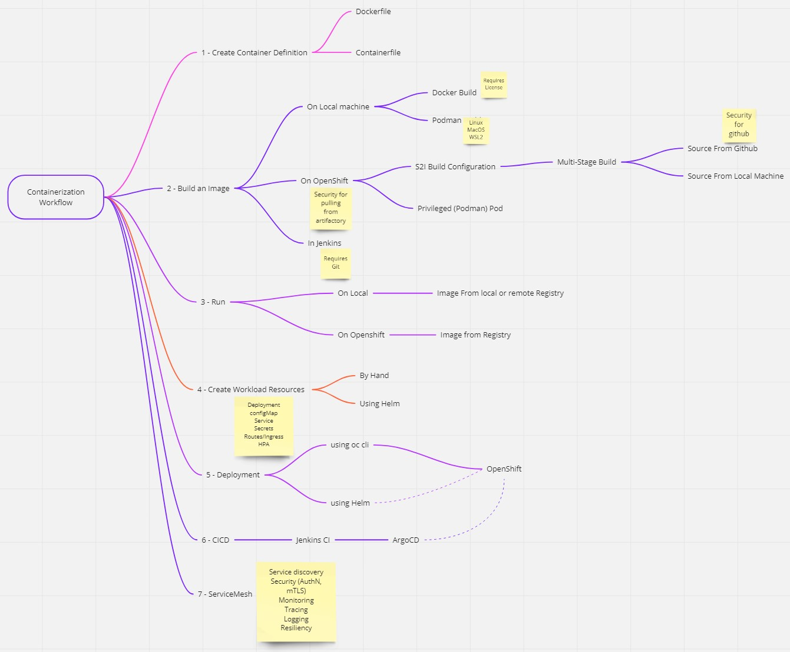

# Containerization Guide with OpenLiberty Web Service Reference Application 

## Guide Description
This repo contains a step by step guide on how to containerize and deploy a JEE/Java webservice application. The steps can also be reused for other applications with slight divergence were the steps are technology specific. These were the steps used to containerize the FAD AIP Services.

## Application Description

The application exposes RESTful services using Jakarta Restful Web Services, JSON-B, and Open Liberty.

  - It has 2 GET endpoints that respond at the following context root URL: http://localhost:9080/ 

  1. ```/api/hello``` - returns string
  ```sh
  Hello World
  ``` 
  
  2. ```/api/properties``` - returns a JSON  of the system properties like this:
  ```sh
  {
	"java.vendor": "IBM Corporation",
	"java.vm.version": "openj9-0.32.0",
	"java.specification.version": "11",
	"jdk.extensions.version": "11.0.15.0",
	"com.ibm.ws.beta.edition": "false",
	"sun.jnu.encoding": "UTF-8",
	"wlp.install.dir": "/opt/ol/wlp/"
  }
  ```

Additional documentaion on the base application can be found here;
  https://openliberty.io/guides/rest-intro.html
  

### How to run application locally
To run type:
```sh
$ mvn liberty:run
```
Application is running when you see

> The defaultServer server is ready to run a smarter planet.

Test the application, submit GET request to these endpoints: 
>http://localhost:9081/api/hello 


>http://localhost:9081/api/properties 

Home page:
>http://localhost:9081/

To stop:
```sh
CTRL+C 
or
$ mvn liberty:stop
```
<hr>


# Containerizing and running application on Openshift

## Step 1: Create a ```Dockerfile``` or ```Containerfile```

- There are 2 ways to do this

### 1. Using Docker or Podman
- To create and validate a ```Dockerfile``` you will need to install either Podman or Docker on your computer.
- [Dockerfile checklist](https://grid.blueshieldca.com/display/RHT/Dockerfile+Checklist)


### 2. Using Openshift S2I Process
>What is source-to-image (S2I)? 
> - [source-to-image github](https://github.com/openshift/source-to-image)
> - [Redhat OCP documentation](https://docs.openshift.com/container-platform/4.10/openshift_images/using_images/using-s21-images.html)
> - [An example](https://tomd.xyz/openshift-s2i-example/)
>
 
- Create a multi-stage Dockerfile that will compile the code and and then build the image (see ```Dockerfile.builder```)
- Create helm chart to deploy the S2I's ```deployconfig``` and ```imagestream``` resources for building and saving application image to the internal registry. 

Helm documentation: https://docs.bitnami.com/tutorials/create-your-first-helm-chart/
```sh
# create chart called build
$ helm create build
# Update Chart, templates and values yamls (see example in this repo).
```

- The maven build stage requires credentials to login to artifactory, the following steps creates sealed secrets to be passed to the process

- <a href="#sealedsecret">How To create Sealed Secret</a>

<b>Steps to create Maven settings sealed secret</b>

- Get an **ARTIFACTORY_TOKEN**. To create one, login to [Artifactory](https://artifactory.bsc.bscal.com/artifactory/webapp/#/profile) &rarr; Click on userID on right hand corner &rarr; Create TOKEN &rarr; Copy and save token
- use the below steps on a terminal to seal the ```settings.xml``` and ```security-settings.xml``` with artifactory credentials to be used in the maven build.
```sh
export NAMESPACE=<namespace>
export ARTIFACTORY_USER=<LAN ID>
export M2_MASTER_PASSWORD=<LAN PASSWORD>
export ARTIFACTORY_TOKEN=<PASTE TOKEN> 
export ENCRYPTED_MASTER_PASSWORD=$(mvn --encrypt-master-password ${M2_MASTER_PASSWORD})
envsubst <settings-security.xml > ${HOME}/.m2/settings-security.xml
export ENCRYPTED_PASSWORD=$(mvn --encrypt-password ${ARTIFACTORY_TOKEN})
envsubst <settings.xml > ${HOME}/.m2/settings.xml

# Run below commands to create the sealed secret for maven settings (one time)

oc create secret generic helloworldopenshift-settings-mvn --dry-run=client --from-file=settings.xml=$HOME/.m2/settings.xml --from-file=settings-security.xml=$HOME/.m2/settings-security.xml -n ${NAMESPACE} -o yaml > /tmp/secret-settings-mvn.yaml

kubeseal -o yaml --controller-namespace sealed-secrets </tmp/secret-settings-mvn.yaml >sealedsecrets/sealedsecret-settings-mvn.yaml -n $NAMESPACE

```
#### Deploy ```buildconfig``` with helm to compile and build application image.

- Generate your **BITBUCKET_TOKEN** from https://bitbucket.bsc.bscal.com/plugins/servlet/access-tokens/add
```sh

#OPTIONAL: export HOME=</c/Users/<LAN ID> for VDI users> 
export BITBUCKET_TOKEN=<your bitbucket token>
export BITBUCKET_USER=<your bitbucket username>

helm upgrade -i helloworldopenshift-build helm/build -n ${NAMESPACE} \
  --set secrets.bitbucket.username=${BITBUCKET_USER} \
  --set secrets.bitbucket.password=${BITBUCKET_TOKEN} \
  --set git.ref=$(git rev-parse --abbrev-ref HEAD) \
  --set git.uri=$(git config --get remote.origin.url) \
  --set-file sealedSecret.settingsMvn=sealedsecrets/sealedsecret-settings-mvn.yaml
```

## Step 2: Deploying Application to ```Openshift```

Create the application helm Chart and deploy and application to Openshift

```sh
helm upgrade -i helloworldopenshift helm/helloworldopenshift -n ${NAMESPACE} \
  --set image.repository=image-registry.openshift-image-registry.svc:5000/${NAMESPACE}/helloworldopenshift \
  --set image.tag=latest 
```

> Once deployed successfully the applicatio endpoints can be accessed by using the route provided in as follows:
> Test the application, submit GET request to these endpoints: 
> https://helloworldopenshift-$NAMESPACE.apps.npek8s.bsc.bscal.com/api/hello 
>
> https://helloworldopenshift-$NAMESPACE.apps.npek8s.bsc.bscal.com/api/properties 
> 
> Home page:
> https://helloworldopenshift-$NAMESPACE.apps.npek8s.bsc.bscal.com/
>

## Containerization Workflow


<h2 id="sealedsecret">Sealed Secrets Pattern</h2>

- Why create a sealed secret?
> It is bad practice to add plaintext passwords or tokens to bitbucket or public repository. For example, do not add property files that contain username and passwords or tokens and other secrets to bitbucket. These should always be encrypted before checking into the repository

- Openshift Secrets are encoded (base64) NOT encrypted, meaning they can be easily decoded.
- we use [Sealed Secrets](https://docs.bitnami.com/tutorials/sealed-secrets) to create a "one-way" encrypted secret which can be checkin to bitbucket repository
> The 2 step process uses ```oc``` and ```kubeseal``` cli tools to create then encrypt the YAML/JSON Openshift Secret Object. Downlod ```oc``` tool from Openshift and ```kubeseal``` [here](https://github.com/bitnami-labs/sealed-secrets/releases)

- This a 2 step process

1. Create the Openshift Secret using ```oc``` (example using the secrets files in /secrets/files)
```sh
oc create secret generic mysecrets --dry-run=client --from-file=/secrets/files/mysecrets.properties -o yaml -n ${NAMESPACE} >/tmp/mysecret.yaml
```

2. Create the Sealed Secret using ```kubeseal```
```sh
kubeseal -o yaml --controller-namespace sealed-secrets </tmp/mysecret.yaml >sealedsecrets/sealedsecret-mysecrets.yaml
```

- Alternatively run the generate_sealedsecrets script
./generate_sealedsecrets.sh

## Database connections Pattern
### Externalizing the ```datasources``` from ```server.xml``` 

- This AIP services use ```JNDI``` lookup to connect to multiple databases. The connections to these databases are configured in ```datasource``` elements which are associated with specific ```JDBC``` providers for the database connectivity. Each database provider has its specific drivers eg ```Oracle``` drivers.
- Each DB connection is configured in a ```datasource``` element in ```server.xml``` with the connection string and database credentials. 
- In order to secure these passwords for the database connections, the ```datasource``` elements have been externalized to a ```datasource-$db.xml``` file that is then referenced in ```server.xml```, for example;

```xml 
<include location="datasource-exampledb.xml" onConflict="REPLACE" optional="true" />
```

- An example of the externalized ```datasource```;
```xml
<server>
    <dataSource jndiName="jdbc/examledb" type="javax.sql.DataSource">
        <jdbcDriver libraryRef="oracle-jdbcLib" />
        <properties.oracle URL="jdbc:oracle:thin:@//EXAMPLEDB:12345/EXAMPLEDB" databaseName="EXAMPLEDB" driverType="thin" password="dbp455w0rd" portNumber="12521" serverName="EXAMPLEDB" user="dbus3r" />
    </dataSource>
</server>>
```
- These are then encrypted as a sealedsecrets then checked into ```bitbucket``` in the ```/sealedsecrets``` folder.
- During deployment, these ```datasource``` fragments are then mounted to the same location as the ```server.xml``` namely ```/config/```

#### Sealing the datasources
- Use the <b>Sealed Secrets Pattern</b> process above.

## NAS Pertistent Volumes Pattern
- Some services require access to persist and read files to and from NAS servers. This requires the use of a ```Persistent volume``` that mounts the specific NAS location to be available in the namespace.
- A ```persisitent volume claim``` to the ```pv``` is then created and the application deployment mounts the ```pvc```
- An example ```helloworldopenshift-pvc``` is added to this deployment and is mounted to ```/nfs```  

# TODO's

## Horizontal Pod AutoScaling patterns
- Implementable in for this app

## CICD Pattern
- Jenkins CI
- ArgoCD 
- Instructions on how to engage SCRM team to get Jenkins Jobs and have pipelines used

## Observability Patterns
- Monitoring use tie in (This is still kinda fuzzy because monitoring team still hasnt showed any actual integration)
- Service Mesh 

#
<hr>

Markdown CheatSheet : https://www.markdownguide.org/cheat-sheet/


